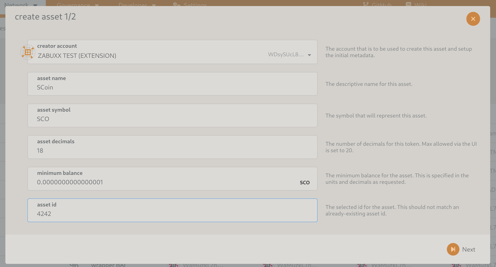
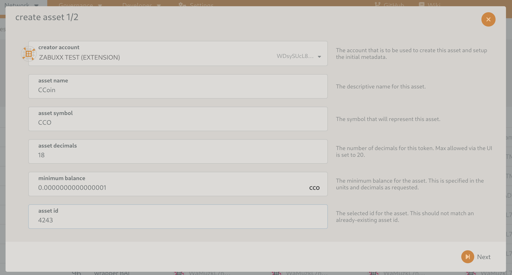
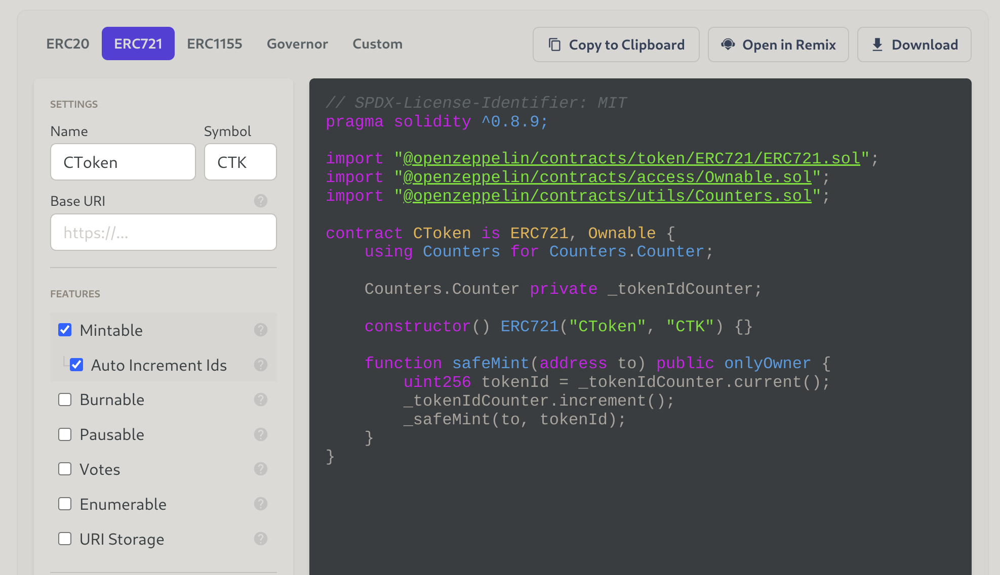
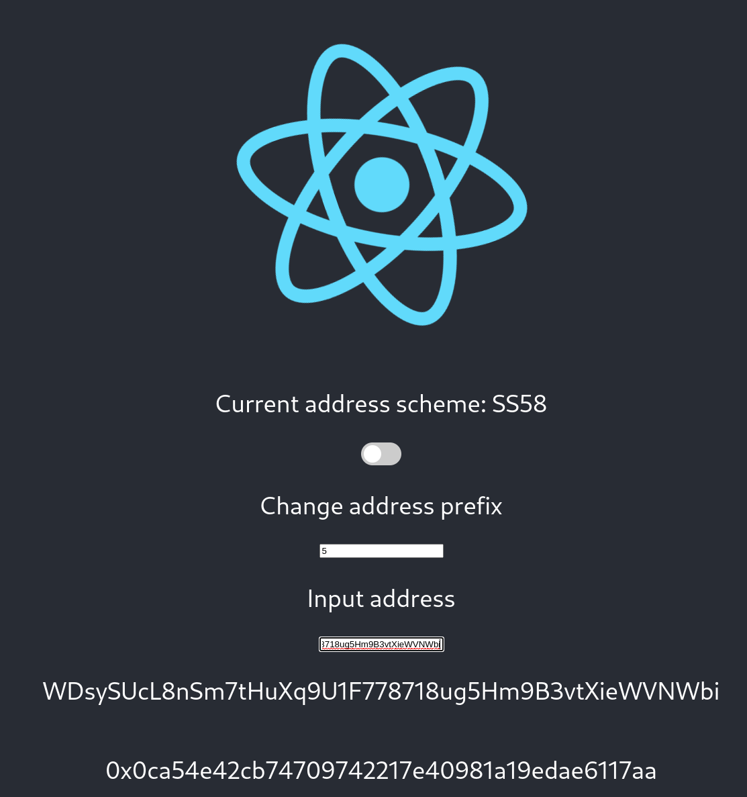
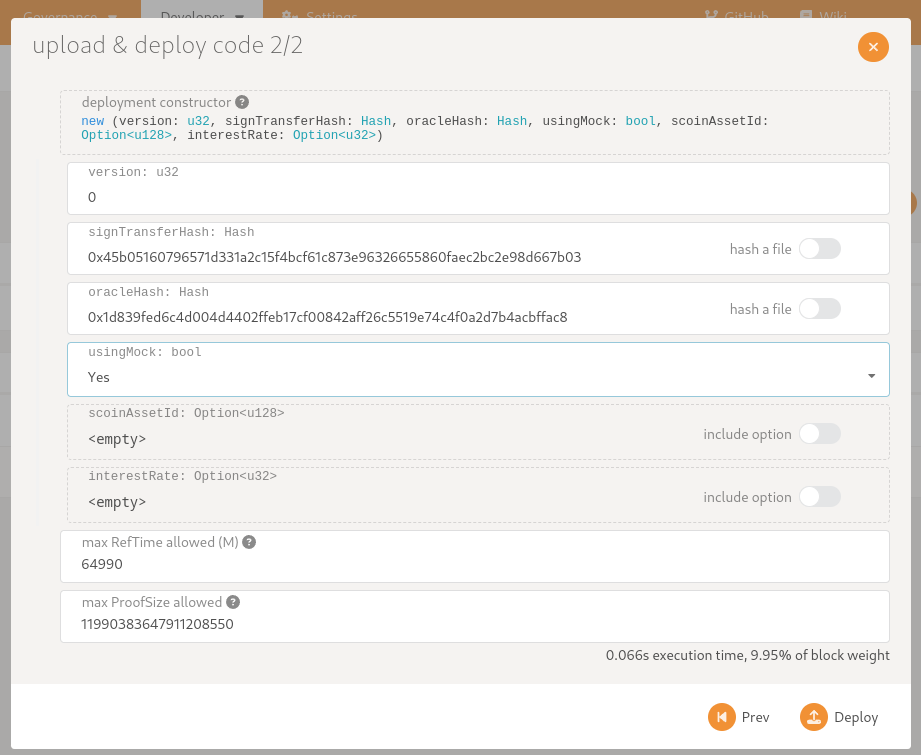

# Setup

This document will guide you through all the necessary steps to locally run this project. 

## Astar node

Download the latest release of the [Astar node](https://github.com/AstarNetwork/Astar/releases) to run it locally:

    $ astar-collator --dev --tmp

### XC20 asset

Create 2 assets (loan, collateral):

From under [Network -> Assets](https://polkadot.js.org/apps/#/assets) click create asset and create them as follows

You have to mint some token for each asset.

Afterwards the tokens can be used as ERC20 tokes (via XC20):

* AssetID 4242 -> 0xFFFFFFFF00000000000000000000000000001092
* AssetID 4243 -> 0xFFFFFFFF00000000000000000000000000001093

You can add these tokens to your Metamask wallet via "Import token" and using the above as contract address.

To provide liquidity to an account in Metamask you need to [convert](https://hoonsubin.github.io/evm-substrate-address-converter/) the H160 address from the Metamask wallet. You can transfer the native token or assets to the converted SS58 address with the polkadot.js explorer.

Or you can add the [Test account](https://github.com/AstarNetwork/Astar/blob/de5b8db29794917ffab8fb0a4a7b2a9a52491452/bin/collator/src/local/chain_spec.rs#L61-L66) that is funded with native token to Metamask.

### ERC721

Using the [Openzeppelin Contract wizard](https://wizard.openzeppelin.com/), you can create an ERC721 contract and deploy it through Remix+Metamask.

Apart from the **Mintable** and **Auto Increment Ids**, the **Enumerable** option is usefull for debugging and testing.

# Manual testing via Polkadot app

## Prepare NFT

Copy the address of the onchain substrate account ID of your test-user (not the wallet address) and use the [address converter](https://hoonsubin.github.io/evm-substrate-address-converter/) to convert the SS58 account ID to an H160 EVM compatible address:

For example:

Now use the Remix interface to call the **safeMint** an NFT to this H160 address. 

Copy the **ERC721 contract address** (H160) and the ID of the NFT that you just minted.

## Build & Deploy the contracts

You can use the [build-all.sh](../wasm-contracts/collateral) script to build all the contracts.

* Deploy **sign_transfer.contract**
* Deploy **oracle.contract**

Copy the hash (Not the address!) of both and supply them as argument for the contructor when deploying **collateral.contract**, also set **usingMock** to true for manual testing.

For example:

## Register Collection

Now that the Collateral contract is succesful deployed, you can call the **registerNFTCollection** function to start accepting NFTs from this collection as collateral for a loan.

You can verify the register action was succesfull using the functions **registeredNFTCollection** and **testQueryOracle**

## Deposit NFT

The first step for an account to start using the Collateral contract is to call the **depositNFT** function.

The arguments for this function are:
* The H160 EVM ERC721 contract address
* The ID of the previously minted NFT

A successfull call to **depositNFT** can be verified by calling **myLoanStatus** for the same user.

If your ERC721-contract has the **Enumerable** option, you can verify the NFT changed owner by calling **ownerOf** for the given NFT ID.
