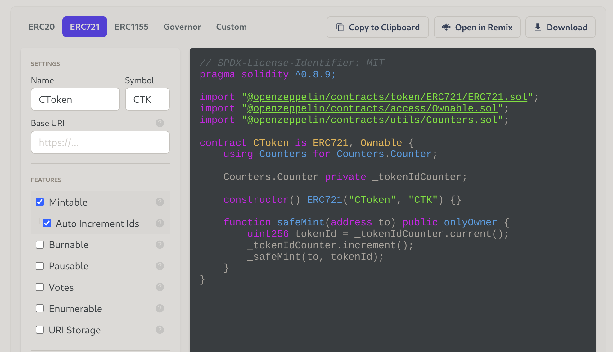

# Setup

This document will guide you through all the necessary steps to locally run this project. 

## Astar node

Download the latest release of the [Astar node](https://github.com/AstarNetwork/Astar/releases) to run it locally:

    $ astar-collator --dev --tmp

### XC20 asset

Create 2 assets (loan, collateral):

From under [Network -> Assets](https://polkadot.js.org/apps/#/assets) click create asset and create them as follows

You have to mint some token for each asset.

Afterwards the tokens can be used as ERC20 tokes (via XC20):

* AssetID 4242 -> 0xFFFFFFFF00000000000000000000000000001092
* AssetID 4243 -> 0xFFFFFFFF00000000000000000000000000001093

You can add these tokens to your Metamask wallet via "Import token" and using the above as contract address.

To provide liquidity to an account in Metamask you need to [convert](https://hoonsubin.github.io/evm-substrate-address-converter/) the H160 address from the Metamask wallet. You can transfer the native token or assets to the converted SS58 address with the polkadot.js explorer.

### ERC721

Using the [Openzeppelin Contract wizard](https://wizard.openzeppelin.com/), you can create an ERC721 contract and deploy it through Remix+Metamask.

