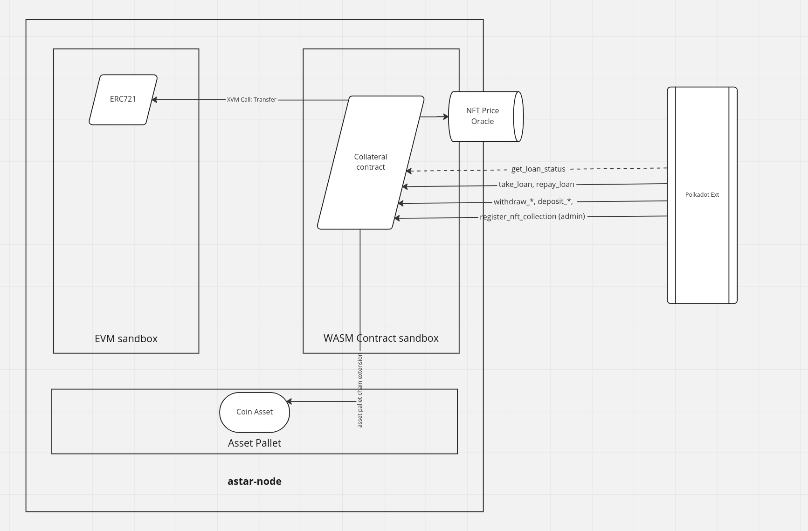

# ok Alice - Dot Vault

This project was submitted as part of the Polkadot Hackathon - Europe Edition - Feb 2023

## Overview

[This document](Doc/DOT%20Vaults.pdf) gives an overview of the project.

To run the project locally, please follow these [setup & test instructions](Doc/Setup%26testing.md).

## Architecture 

The Collateral contract allows a user to deposit an ERC721 or (soon) PSP22 token as a Collateral for a loan. 

The Collateral contract provides the following functionality:

* Deposit and withdraw of ERC721 (&PSP22) tokens
* Take and repay Loan 

### Terminology

 * **Collateral:** valuable token that can be transfered to the contract to increase loan limit of user
 * **Loan Limit:** the maximum loan a user can withdraw
 * **Open Loan:** the current loan balance of a user
 * **Last change:** the blocknumber of last loan balance modification
 * **SCoin:** simulated coin, used to pay out loans
 

## Interface

### Functions

* `depositErc721`, `depositPsp22` - Deposit token as collateral
* `withdrawErc721`, `withdrawPsp22` - Withdraw previously deposited token as collateral
* `takeLoan` - Withdraw SCOIN from contract 
* `repayLoan` - Repay previously lend SCOIN

* `myLoanStatus` - check the loan limit, open loan for the current user

